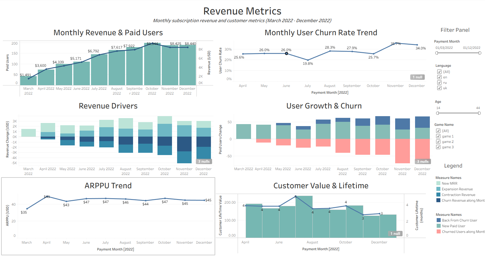

# Revenue Metrics Analysis

## Project Overview

This project focuses on analyzing revenue and customer metrics using Tableau. The goal was to evaluate revenue performance, paid user dynamics, churn, ARPPU, customer lifetime value, and the key drivers of revenue growth and decline.

## Tools

- Tableau
- Calculated Fields
- Data Visualization
- Dashboard Development

## Analysis

- Analyzed monthly revenue and paid user trends
- Evaluated monthly user churn rate
- Analyzed revenue drivers, including New MRR, Expansion Revenue, Contraction Revenue, and Churn Revenue
- Analyzed changes in new, churned, and returning paid users
- Evaluated ARPPU trends over time
- Analyzed customer lifetime value and customer lifetime
- Created an interactive dashboard to summarize key revenue and customer metrics

## Dashboard

The dashboard provides an overview of revenue performance and customer behavior, including revenue growth, paid users, churn, ARPPU, and customer lifetime metrics.

## Project File

`Revenue_Metrics_Analysis.twbx`
